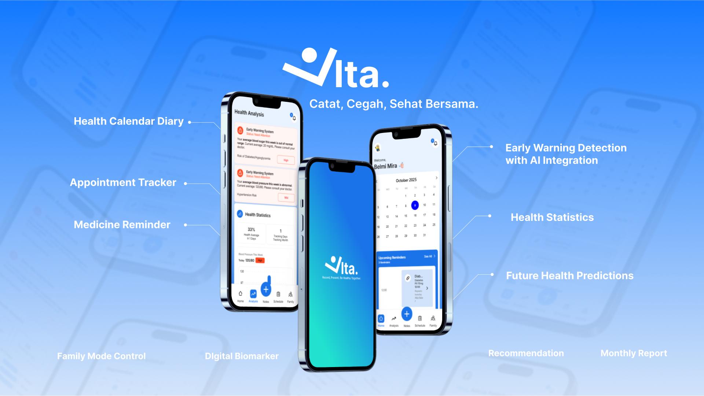
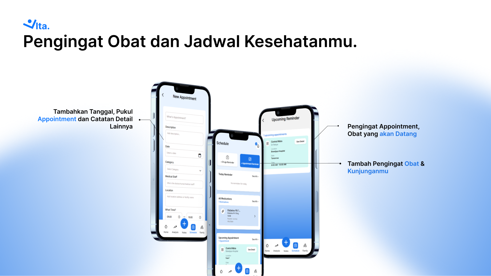
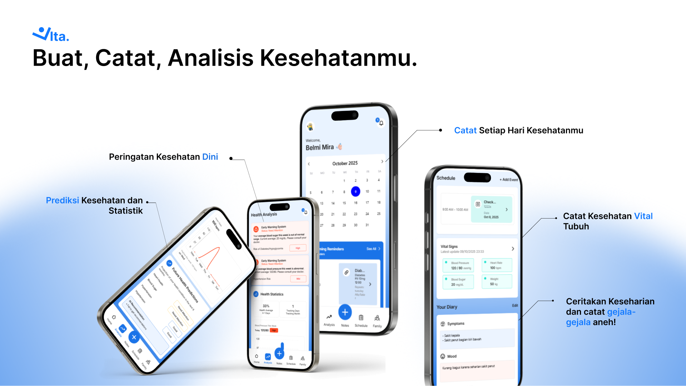
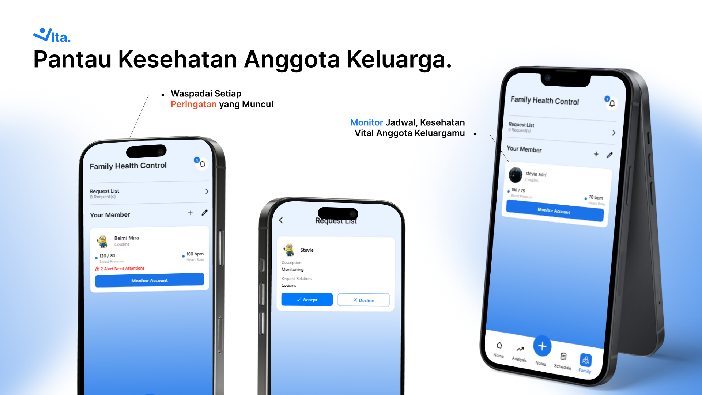

# 🌿 Vita – Your AI Health Companion


---

## 🏆 Tentang Hackathon
Proyek ini dikembangkan untuk **S2C Hackathon 2025**  
Tema: **SDG 3 – Good Health & Well-Being**  
Fokus: *Preventive healthcare dengan AI dan pemantauan keluarga.*

---

## 👥 Tim Pengembang
| Nama | Peran |
|------|--------|
| **Stevie Adrian** | Frontend & Backend Developer |
| **Bryan Cornelius** | Frontend & Backend Developer |
| **Alicia Felisha** | UI/UX, Frontend & Backend Developer |
---

## 💡 About Vita
> “Catat, Cegah, Sehat Bersama.” — Vita, your personal AI health companion.

Vita adalah aplikasi kesehatan berbasis **React Native (Expo)** yang membantu pengguna untuk **memantau kondisi kesehatan, mencatat aktivitas harian, dan menerima pengingat obat maupun janji temu dokter secara otomatis.**  
Aplikasi ini juga dilengkapi **AI Health Advisor** yang memberikan rekomendasi kesehatan personal menggunakan **OpenAI API**.

## 🚀 Tech Stack

| Teknologi | Peran | Keterangan |
|------------|--------|------------|
| ⚛️ **React Native (Expo)** | Frontend | Cross-platform app untuk Android & iOS dengan performa tinggi |
| 🔥 **Firebase** | Backend & Auth | Firestore realtime DB, Authentication, Cloud Functions, Notifications |
| ☁️ **Cloudinary** | Media Storage | Upload, optimasi, dan CDN delivery untuk foto & biomarker |
| 🤖 **OpenAI API** | AI Engine | Memberikan saran, analisis kesehatan, dan prediksi dini |
| 📦 **EAS Build** | Deployment | Untuk generate .APK / .AAB produksi |

## ⚙️ How To Run?

### 1️⃣ Clone Repository
```bash
git clone https://github.com/StevieAdrian/Vita.git
cd Vita
```
### 2️⃣ Install Dependencies
```bash
npm install
```

### 3️⃣ Setup Environment Variables
Buat file ```.env``` / copy file ```.env``` dari google drive, dan letakkan di root folder.

### 4️⃣ Jalankan Aplikasi
```bash
npx expo start
```
Terdapat beberapa pilihan, meliputi:
- Android Emulator
- Expo Go (scan QR code)
- Development Build

Aplikasi juga bisa dijalankan melalui website dekstop secara local, dengan melakukan click pada link localhost setelah melakukan running, dan melakukan pergantian responsive ke resolusi mobile (ex: iph 14) melalui inspect elemen

## 📱 Fitur Utama

### 🩺 **Health Diary & Tracker**
Catat tanda vital tubuh (seperti tekanan darah, suhu, dan mood harian) dalam kalender kesehatan interaktif.  
- Input data kesehatan harian secara manual  
- Simpan histori kesehatan dan tampilkan grafik perkembangan  
- Dapat digunakan untuk deteksi perubahan kondisi tubuh dari waktu ke waktu  

---

### 💊 **Medicine Reminder**
Dapatkan notifikasi otomatis untuk pengingat minum obat tepat waktu.  
- Tambah pengingat obat dengan jam, nama obat, dan catatan  
- Terintegrasi dengan notifikasi sistem Android  
- Notifikasi muncul meskipun aplikasi tidak sedang dibuka  

---

### 📅 **Appointment Tracker**
Atur dan kelola jadwal kunjungan dokter serta kontrol rutin.  
- Tambahkan tanggal, waktu, dan lokasi appointment  
- Dapatkan pengingat otomatis sebelum jadwal  
- Lihat daftar appointment mendatang dalam satu tampilan kalender  

---

### 🧠 **AI Health Advisor**
Asisten kesehatan cerdas berbasis **OpenAI API** untuk memberikan analisis dan rekomendasi.  
- Analisis laporan kesehatan dan gejala pengguna  
- Memberikan saran personal berbasis input pengguna  
- Digunakan untuk fitur *Early Warning Detection* dan *Future Health Prediction*  

---

### 🚨 **Early Warning Detection**
Deteksi dini kondisi kesehatan yang perlu diwaspadai.  
- Menggunakan data dari Health Diary & AI Analysis  
- Menampilkan indikator “perlu perhatian” secara otomatis  
- Dapat membantu pengguna melakukan pencegahan lebih awal  

---

### 📈 **Health Statistics & Monthly Report**
Lihat perkembangan kesehatan dalam bentuk visual dan laporan PDF bulanan.  
- Grafik statistik tekanan darah, suhu, detak jantung, dll  
- Unduh laporan dalam format PDF untuk dibagikan ke tenaga medis  
- Highlight otomatis untuk data “merah” atau di luar batas normal  

---

### 👨‍👩‍👧 **Family Mode**
Pantau kesehatan seluruh anggota keluarga dalam satu aplikasi.  
- Kirim dan terima permintaan pemantauan kesehatan  
- Lihat data vital dan peringatan dini milik anggota keluarga  
- Ideal untuk orang tua yang ingin memantau anak atau lansia  

---

### 💬 **Smart Notifications**
Notifikasi real-time untuk pengingat obat, appointment, dan alert AI.  
- Terintegrasi dengan Firebase Cloud Messaging (FCM)  
- Menampilkan jenis notifikasi berbeda (obat, jadwal, analisis, family)  
- Dapat disesuaikan berdasarkan waktu & kategori kesehatan  

---

### 🤖 **Future Health Prediction**
Prediksi kondisi kesehatan masa depan berdasarkan data historis pengguna.  
- Menggunakan model prediksi berbasis AI sederhana  
- Membantu pengguna mengenali pola risiko  
- Ditampilkan dalam halaman *Analysis* sebagai insight tambahan  

---

### 🧾 **Digital Biomarker Upload**
Simpan data biomarker dan gambar hasil pemeriksaan secara aman.  
- Menggunakan **Cloudinary** untuk penyimpanan media  
- Otomatis dioptimasi agar ringan & cepat diakses  
- Dapat dihubungkan dengan riwayat diary pengguna

  ## 🖼️ Preview Tampilan

| Tampilan | Deskripsi |
|-----------|------------|
|  | Reminder obat & appointment |
|  | Diary, AI Health Advisor & Early Warning |
|  | Family Mode monitoring |


📂 **Google Drive Resources**
Beberapa file tambahan seperti `.env` dan asset pendukung tersedia di link berikut:  
👉 [Vita Project Resources (Google Drive)](https://drive.google.com/drive/folders/1xyfNBtO0BqwLqAKhCVxY3WuR5V3TrGG4?usp=sharing)

